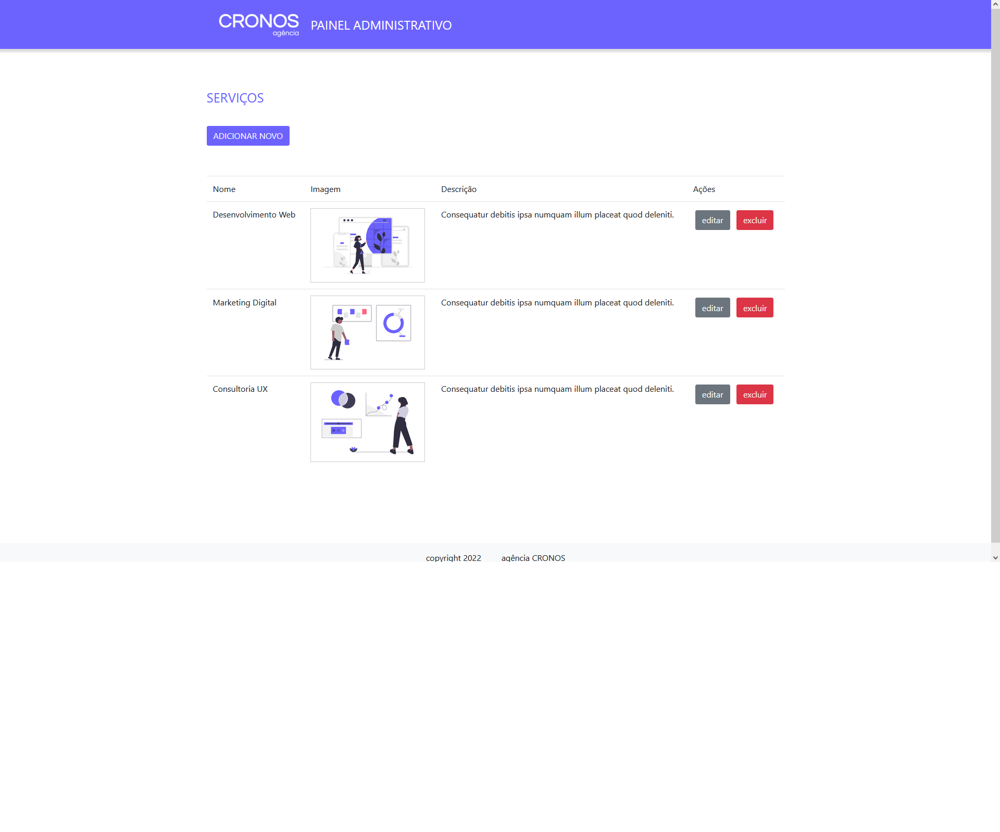
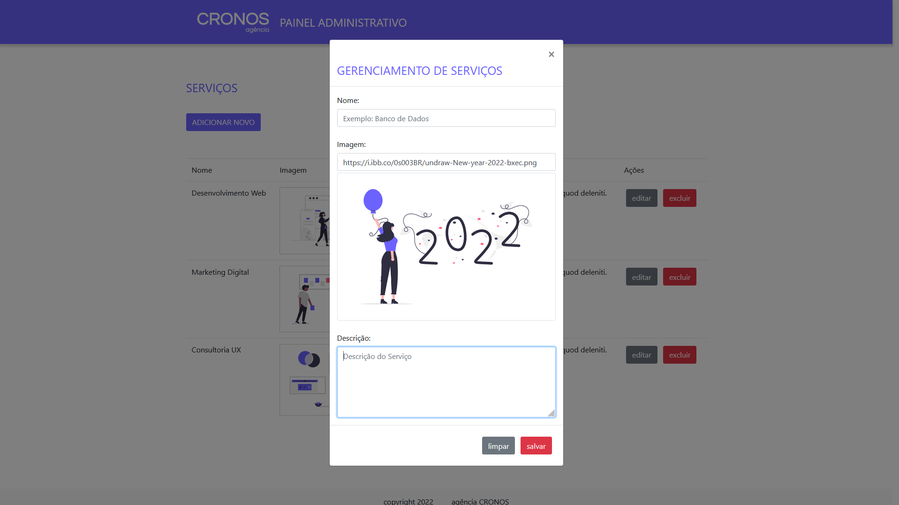
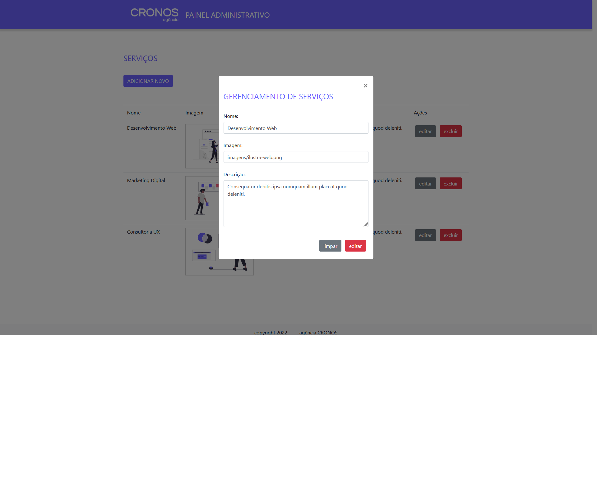

<h1 align="center">
  
</h1>

<p align="center">
  
  
  
  
  
  


</p>

<h1 align="center">CRONOS Agência</h1>

## 💻 Sobre o projeto

Agência Cronos nos contratou para o desenvolvimento do site institucional, o foco é no gerenciamento de serviços.

- Desenvolvimento das funcionalidades para criar, editar e deletar serviços da lista (o famoso CRUD).

Projeto desenvolvido durante o Gama Experience XP39 oferecida pela  <a href="https://www.gama.academy/gama-experience/desenvolvimento-full-stack">[Gama Academy]</a>

## 🎨 Layout

<p align="center" style="display: flex; align-items: flex-start; justify-content: center;">
  

  
  
   
</p>

## 🛠 Tecnologias

As seguintes ferramentas foram usadas na construção do projeto:

- HTML5
- CSS3
- JAVASCRIPT
- REACT

## 🚀 Como executar o projeto

Pré-requisitos
Antes de começar, você vai precisar ter instalado em sua máquina as seguintes ferramentas: Git, Node.js. Além disto é bom ter um editor para trabalhar com o código como VSCode


### 🧭 Rodando a aplicação web

```bash
# Clone este repositório
$ git clone https://github.com/lenamsst/desafiojs_agencia-cronos-adm.git

# Acesse a pasta do projeto no seu terminal/cmd
$ cd desafiojs_agencia-cronos-adm

# Instale as dependências
$ npm install

# Execute a aplicação em modo de desenvolvimento
$ npm run start

# A aplicação será aberta na porta:3000 - acesse http://localhost:3000
```

## 😯 Como contribuir para o projeto

1. Faça um **fork** do projeto.
2. Crie uma nova branch com as suas alterações: `git checkout -b my-feature`
3. Salve as alterações e crie uma mensagem de commit contando o que você fez: `git commit -m "feature: My new feature"`
4. Envie as suas alterações: `git push origin my-feature`
> Caso tenha alguma dúvida confira este [guia de como contribuir no GitHub](https://github.com/firstcontributions/first-contributions)

## 🤝 Colaboradores

Pessoas que contribuíram para este projeto:


<table>
  <tr>
    <td align="center"><a href="https://github.com/lenamsst"><br /><sub><b>Milena Garcia</b></sub></a><br/></td>
    <td align="center"><a href="https://github.com/thaisanchieta"><br /><sub><b>Thais Anchieta</b></sub></a><br /></td>
  </tr>
</table>
 
